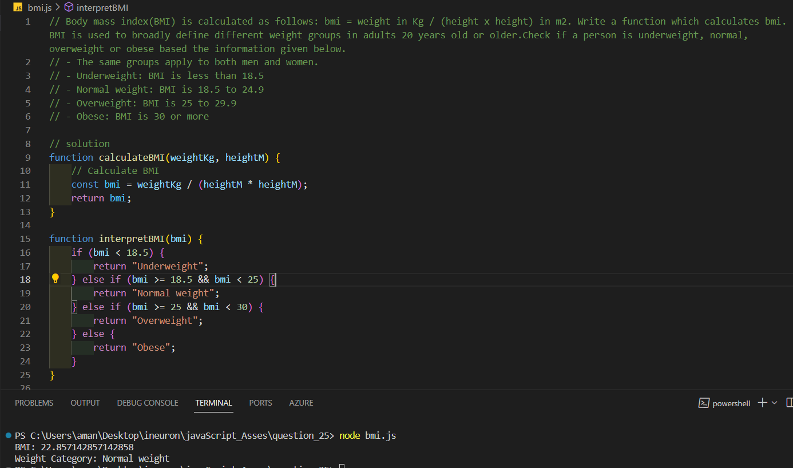
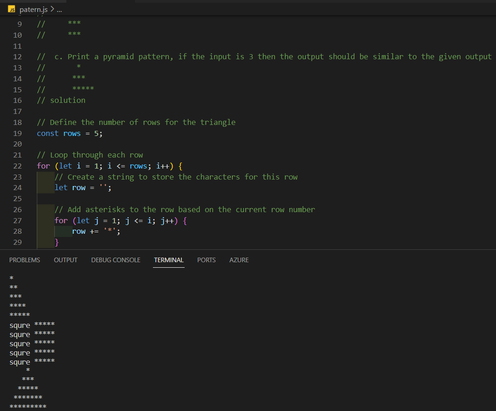
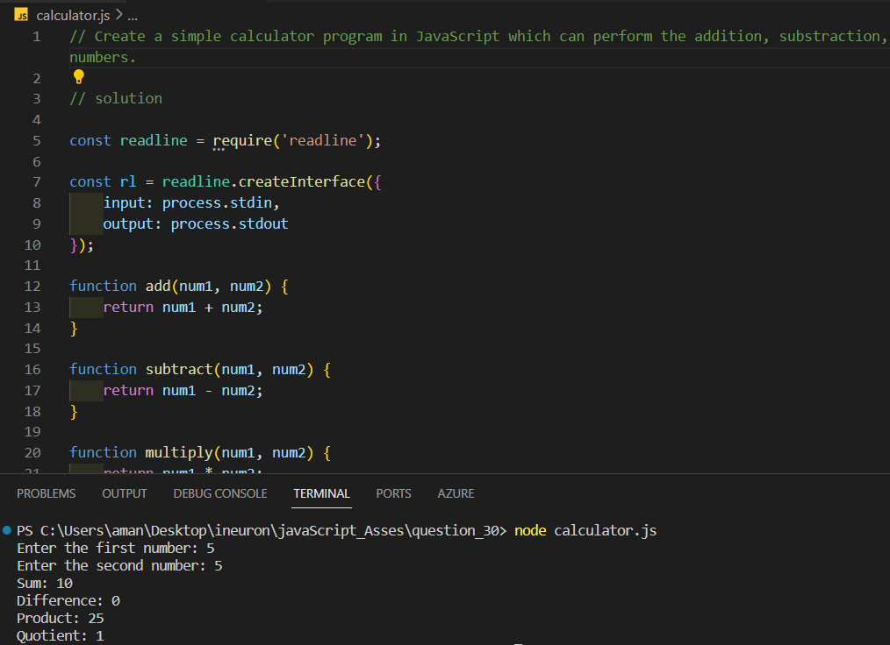

# JavaScript Assesment

## Question_01
### solution

## Question_02
### solution

## Question_03
### solution

## Question_04
### solution

## Qustion_05
### solution

## Question_06
### solution

## Question_07
### solution

## Question_08
### solution

## Question_09
### solution

## Question_10
### solution

## Question_11
### solution

## Question_12
### solution

## Question_13
### solution

## Question_14
### solution

## Question_15
### solution

## Question_16
### solution

## Question_17
### solution

## Question_18
### solution

## Question_19
### solution

## Question_20
### solution

## Question_21
### solution

## Question_22
### solution

## Question_23
### solution

## Question_24
### solution

## Question_25
### solution

## Question_26
### solution

## Question_27
### solution

## Question_28
### solution

## Question_29
### solution

## Question_30
### solution
